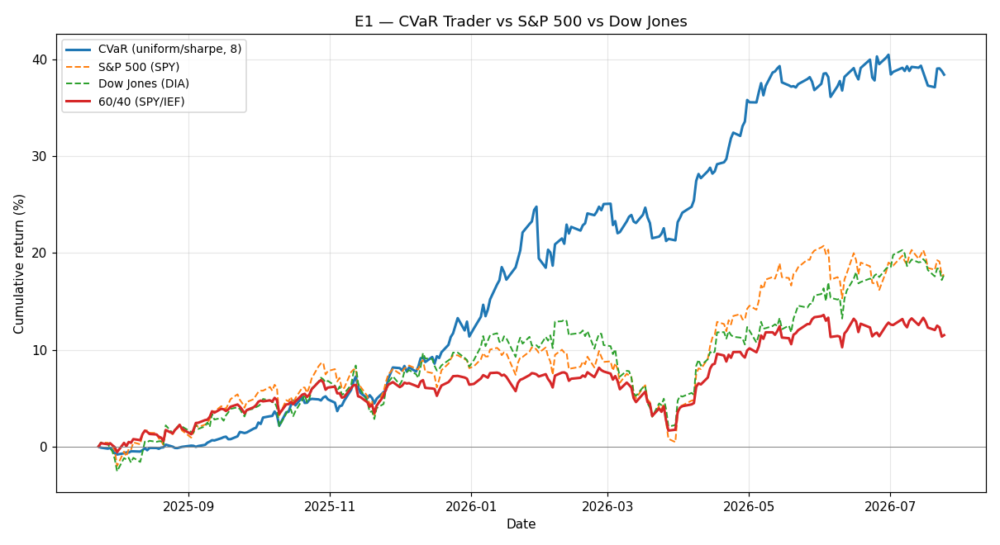

# E1 — CVaR Trader vs S&P 500 vs Dow Jones

**Window:** 2025-07-24 → 2026-07-24 (252 trading days)  
**Universe selected as of:** 2022-06-17 (no lookahead)

Baseline CVaR trader on an 8-asset universe selected by PCA + k-means (one asset per cluster, Sharpe-ranked).

**Universe:** `['UNH', 'PDBC', 'TSLA', 'KO', 'CAT', 'LQD', 'EEM', 'SLV']`

## Results

| Strategy | Ann. Return | Ann. Vol | Sharpe (excess) | Max Drawdown |
|---|---|---|---|---|
| CVaR (uniform/sharpe, 8) | 38.43% | 10.82% | 3.18 | -5.06% |
| S&P 500 (SPY) | 17.77% | 12.71% | 1.08 | -8.88% |
| Dow Jones (DIA) | 17.77% | 12.26% | 1.12 | -9.76% |
| 60/40 (SPY/IEF) | 11.52% | 8.25% | 0.91 | -6.00% |

