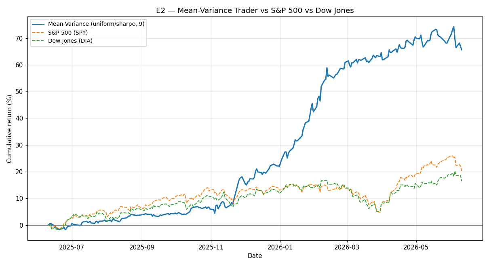

# E2 — Mean-Variance Trader vs S&P 500 vs Dow Jones

**Window:** 2025-06-10 → 2026-06-10 (252 trading days)  
**Universe selected as of:** 2023-12-24 (no lookahead)

Baseline mean-variance trader (HMM-regime risk aversion) on a 9-asset PCA/k-means universe.

**Universe:** `['CAT', 'HYG', 'UNH', 'MCD', 'XOM', 'JPM', 'GLD', 'GOOGL', 'AVGO']`

## Results

| Strategy | Ann. Return | Ann. Vol | Sharpe | Max Drawdown |
|---|---|---|---|---|
| Mean-Variance (uniform/sharpe, 9) | 65.65% | 14.20% | 4.62 | -4.96% |
| S&P 500 (SPY) | 20.29% | 12.23% | 1.66 | -9.13% |
| Dow Jones (DIA) | 16.44% | 12.40% | 1.33 | -10.06% |

