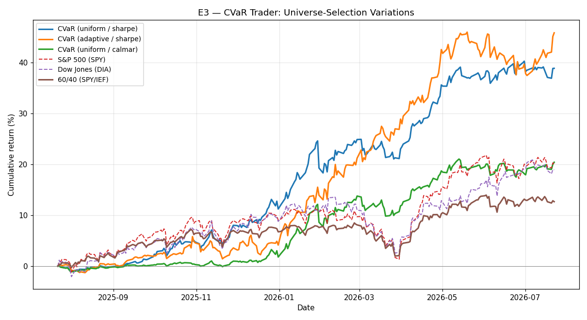

# E3 — CVaR Trader: Universe-Selection Variations

**Window:** 2025-07-22 → 2026-07-22 (252 trading days)  
**Universe selected as of:** 2022-06-14 (no lookahead)

How the universe-selection knobs affect the CVaR trader:

- **uniform / sharpe:** `['TSLA', 'SLV', 'LQD', 'EEM', 'PDBC', 'KO', 'CAT', 'UNH']`
- **adaptive / sharpe:** `['TSLA', 'UNH', 'CAT', 'EEM', 'PDBC', 'USO', 'XLE', 'XOM']`
- **uniform / calmar:** `['UNH', 'PDBC', 'TSLA', 'KO', 'XLB', 'LQD', 'EEM', 'SLV']`

## Results

| Strategy | Ann. Return | Ann. Vol | Sharpe (excess) | Max Drawdown |
|---|---|---|---|---|
| CVaR (uniform / sharpe) | 38.90% | 10.81% | 3.23 | -5.06% |
| CVaR (adaptive / sharpe) | 45.88% | 12.99% | 3.22 | -5.84% |
| CVaR (uniform / calmar) | 20.43% | 8.20% | 2.01 | -3.91% |
| S&P 500 (SPY) | 20.17% | 12.66% | 1.28 | -8.88% |
| Dow Jones (DIA) | 18.96% | 12.28% | 1.22 | -9.76% |
| 60/40 (SPY/IEF) | 12.68% | 8.20% | 1.06 | -6.00% |

