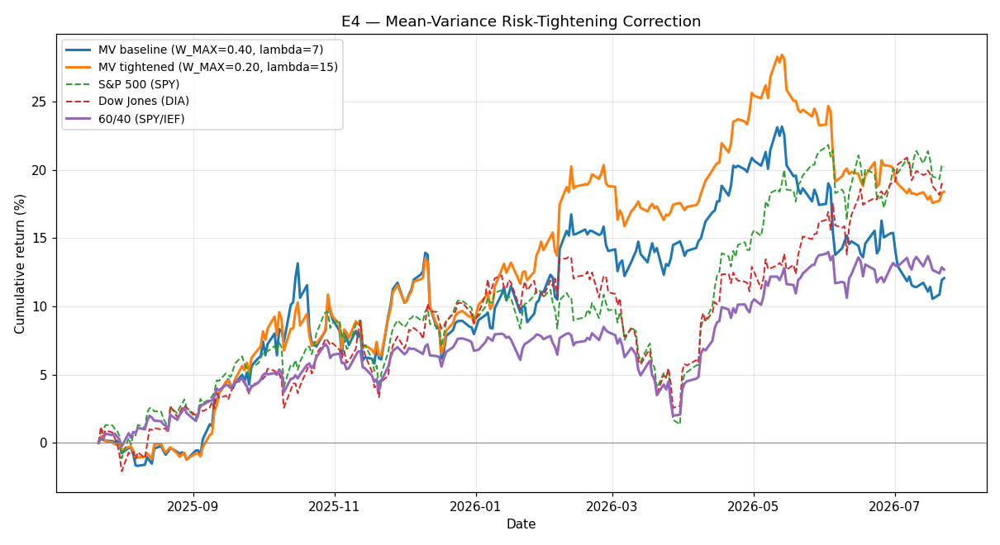

# E4 — Mean-Variance Risk-Tightening Correction

**Window:** 2025-07-22 → 2026-07-22 (252 trading days)  
**Universe selected as of:** 2022-06-14 (no lookahead)

A simple, pragmatic correction to the mean-variance objective/constraints: halve the per-asset weight cap (0.40 → 0.20) and roughly double risk aversion (7 → 15). This trades some upside for materially smaller drawdowns.

**Universe:** `['CAT', 'HYG', 'UNH', 'SLV', 'AVGO', 'KO', 'PDBC', 'EEM', 'TSLA']`

## Results

| Strategy | Ann. Return | Ann. Vol | Sharpe (excess) | Max Drawdown |
|---|---|---|---|---|
| MV baseline | 12.06% | 13.84% | 0.58 | -10.24% |
| MV tightened | 18.38% | 12.38% | 1.16 | -8.45% |
| S&P 500 (SPY) | 20.17% | 12.66% | 1.28 | -8.88% |
| Dow Jones (DIA) | 18.96% | 12.28% | 1.22 | -9.76% |
| 60/40 (SPY/IEF) | 12.68% | 8.20% | 1.06 | -6.00% |

