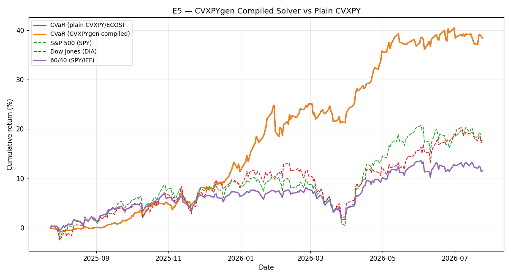

# E5 — CVXPYgen Compiled Solver vs Plain CVXPY

**Window:** 2025-07-24 → 2026-07-24 (252 trading days)  
**Universe selected as of:** 2022-06-17 (no lookahead)

Validates the CVXPYgen-compiled solver (`fast_cvar.py`): the same enhanced-CVaR problem, recast as a DPP-parametric program and compiled to C.

- Plain CVXPY backtest: **11.1s**
- Compiled backtest: **5.2s**  (**2.1x** faster)
- Max equity-curve difference: **3.88e-11** (identical within tolerance)

**Universe:** `['TSLA', 'SLV', 'LQD', 'EEM', 'PDBC', 'KO', 'CAT', 'UNH']`

## Results

| Strategy | Ann. Return | Ann. Vol | Sharpe (excess) | Max Drawdown |
|---|---|---|---|---|
| CVaR plain | 38.43% | 10.82% | 3.18 | -5.06% |
| CVaR compiled | 38.43% | 10.82% | 3.18 | -5.06% |
| S&P 500 (SPY) | 17.77% | 12.71% | 1.08 | -8.88% |
| Dow Jones (DIA) | 17.77% | 12.26% | 1.12 | -9.76% |
| 60/40 (SPY/IEF) | 11.52% | 8.25% | 0.91 | -6.00% |

