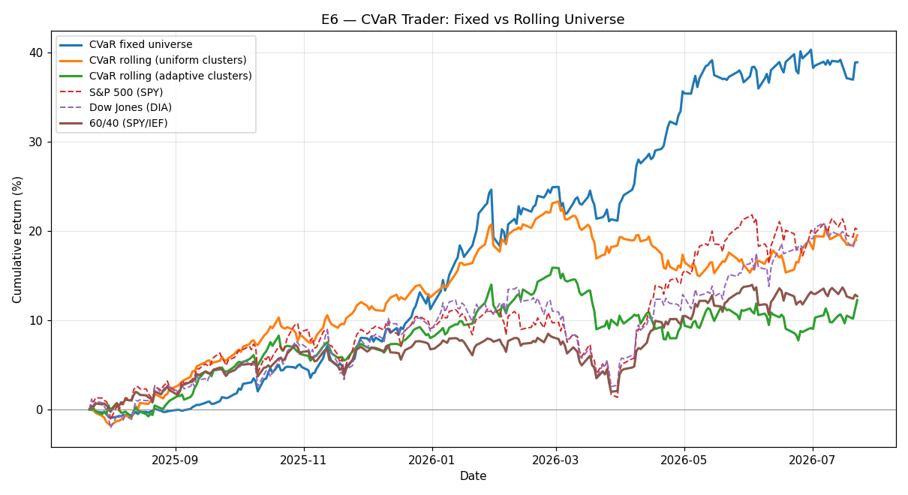

# E6 — CVaR Trader: Fixed vs Rolling Universe

**Window:** 2025-07-22 → 2026-07-22 (252 trading days)  
**Universe selected as of:** 2022-06-14 (no lookahead)

The universe is re-surveyed every ~quarter (63 trading days) using only past data, so the portfolio can rotate into newly-surging leaders. Three modes:

- **fixed** — one universe chosen at the start and held;
- **rolling / uniform** — re-selected each quarter, one asset per cluster;
- **rolling / adaptive** — re-selected each quarter *and* the per-cluster slot allocation re-tilts toward the strongest-performing clusters.

> **Caveat:** rolling selection picks *recent* winners, which tend to mean-revert; it also adds turnover (not charged here). Compare the table below — a stable, diversified universe can beat quarterly winner-chasing in a trending market.

### Rolling adaptive universe over time

13 re-selections:

- 2023-06-16: `['NVDA', 'AVGO', 'XLK', 'QQQ', 'GE', 'BA', 'MCD', 'LQD']`
- 2023-09-18: `['MCD', 'GE', 'NVDA', 'META', 'QQQ', 'XLK', 'MSFT', 'XOM']`
- 2023-12-15: `['XLK', 'QQQ', 'META', 'AAPL', 'GE', 'AVGO', 'NVDA', 'GLD']`
- 2024-03-19: `['NVDA', 'AVGO', 'META', 'XLK', 'GE', 'XOM', 'ITA', 'BA']`
- 2024-06-18: `['HYG', 'GE', 'NVDA', 'META', 'AVGO', 'QQQ', 'XLK', 'ITA']`
- 2024-09-18: `['XLF', 'JPM', 'GS', 'BAC', 'NVDA', 'META', 'GE', 'HYG']`
- 2024-12-17: `['NVDA', 'AVGO', 'QQQ', 'XLC', 'META', 'AMZN', 'GOOGL', 'XLF']`
- 2025-03-21: `['NVDA', 'SPY', 'XLC', 'META', 'GLD', 'GE', 'HYG', 'BND']`
- 2025-06-23: `['GE', 'XLU', 'GLD', 'XLC', 'META', 'SLV', 'MSFT', 'XOM']`
- 2025-09-22: `['GS', 'GE', 'HYG', 'GLD', 'FXI', 'BND', 'LQD', 'CVX']`
- 2025-12-19: `['XLU', 'GLD', 'SLV', 'GS', 'HYG', 'GE', 'XLC', 'BND']`
- 2026-03-24: `['MU', 'GLD', 'CVX', 'PDBC', 'XOM', 'ITA', 'GE', 'BA']`
- 2026-06-24: `['BND', 'MU', 'JNJ', 'GE', 'ITA', 'GLD', 'PDBC', 'XOM']`

**Fixed universe:** `['UNH', 'PDBC', 'TSLA', 'KO', 'CAT', 'LQD', 'EEM', 'SLV']`

## Results

| Strategy | Ann. Return | Ann. Vol | Sharpe (excess) | Max Drawdown |
|---|---|---|---|---|
| CVaR fixed | 38.90% | 10.81% | 3.23 | -5.06% |
| CVaR rolling (uniform) | 19.52% | 7.84% | 1.98 | -6.79% |
| CVaR rolling (adaptive) | 12.26% | 8.93% | 0.93 | -7.03% |
| S&P 500 (SPY) | 20.17% | 12.66% | 1.28 | -8.88% |
| Dow Jones (DIA) | 18.96% | 12.28% | 1.22 | -9.76% |
| 60/40 (SPY/IEF) | 12.68% | 8.20% | 1.06 | -6.00% |

