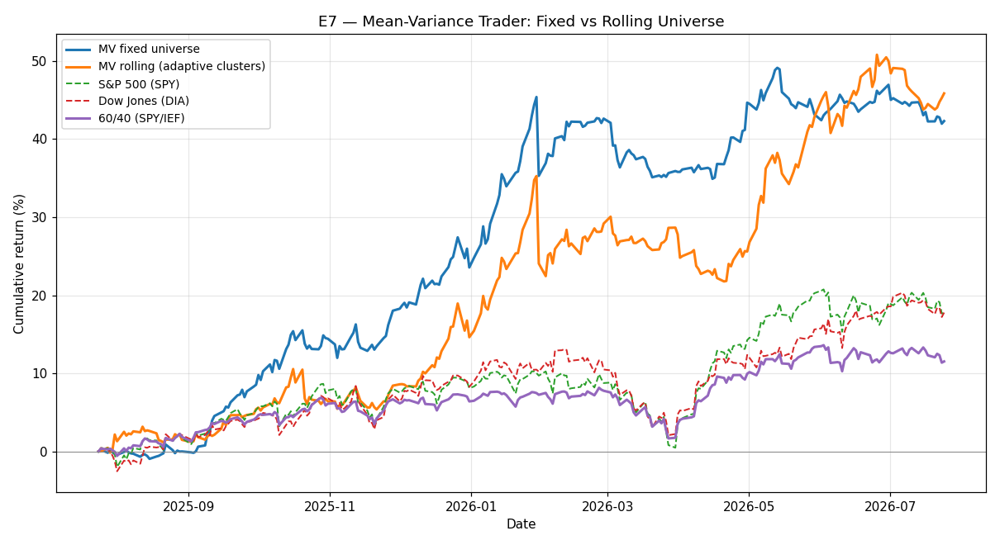

# E7 — Mean-Variance Trader: Fixed vs Rolling Universe

**Window:** 2025-07-24 → 2026-07-24 (252 trading days)  
**Universe selected as of:** 2022-06-17 (no lookahead)

Mean-variance trader with a fixed universe vs a rolling universe re-surveyed every ~quarter with adaptive cluster weighting (slots tilt toward recently strong clusters). Rolling variant uses static risk-aversion for simplicity.

> **Caveat:** chasing recent winners quarterly adds turnover and timing risk; see whether it actually improves risk-adjusted returns in the table below.

### Rolling adaptive universe over time

13 re-selections:

- 2023-06-22: `['NVDA', 'AVGO', 'XLK', 'AAPL', 'META', 'XOM', 'GE', 'BA', 'MCD']`
- 2023-09-21: `['GE', 'NVDA', 'AVGO', 'META', 'CAT', 'GLD', 'XOM', 'XLE', 'XLV']`
- 2023-12-20: `['MCD', 'GE', 'BA', 'AVGO', 'NVDA', 'XLK', 'QQQ', 'META', 'XOM']`
- 2024-03-22: `['NVDA', 'AVGO', 'XLK', 'MU', 'TSM', 'GE', 'META', 'XOM', 'PG']`
- 2024-06-24: `['JPM', 'XLF', 'NVDA', 'META', 'QQQ', 'XLK', 'XLC', 'SPY', 'GE']`
- 2024-09-23: `['HYG', 'KO', 'XLP', 'GE', 'NVDA', 'SPY', 'META', 'VTI', 'ITA']`
- 2024-12-20: `['NVDA', 'AVGO', 'QQQ', 'XLC', 'META', 'AMZN', 'GOOGL', 'XLF', 'HYG']`
- 2025-03-26: `['NVDA', 'SPY', 'XLC', 'META', 'AMZN', 'GE', 'GLD', 'HYG', 'BND']`
- 2025-06-26: `['BND', 'GE', 'NVDA', 'XLU', 'GLD', 'XLC', 'META', 'SLV', 'MSFT']`
- 2025-09-25: `['GE', 'HYG', 'ITA', 'GLD', 'SLV', 'FXI', 'BND', 'LQD', 'CVX']`
- 2025-12-24: `['HYG', 'GS', 'ITA', 'GLD', 'SLV', 'JNJ', 'BND', 'LQD', 'XOM']`
- 2026-03-27: `['XLU', 'MU', 'ITA', 'GE', 'BA', 'PDBC', 'CVX', 'XOM', 'XLE']`
- 2026-06-29: `['BND', 'MU', 'JNJ', 'GE', 'ITA', 'GLD', 'SLV', 'BA', 'PDBC']`

**Fixed universe:** `['TSLA', 'LQD', 'CAT', 'PDBC', 'KO', 'SLV', 'EEM', 'UNH', 'XLI']`

## Results

| Strategy | Ann. Return | Ann. Vol | Sharpe (excess) | Max Drawdown |
|---|---|---|---|---|
| MV fixed | 42.31% | 14.08% | 2.72 | -7.21% |
| MV rolling (adaptive) | 45.85% | 17.14% | 2.44 | -9.98% |
| S&P 500 (SPY) | 17.77% | 12.71% | 1.08 | -8.88% |
| Dow Jones (DIA) | 17.77% | 12.26% | 1.12 | -9.76% |
| 60/40 (SPY/IEF) | 11.52% | 8.25% | 0.91 | -6.00% |

