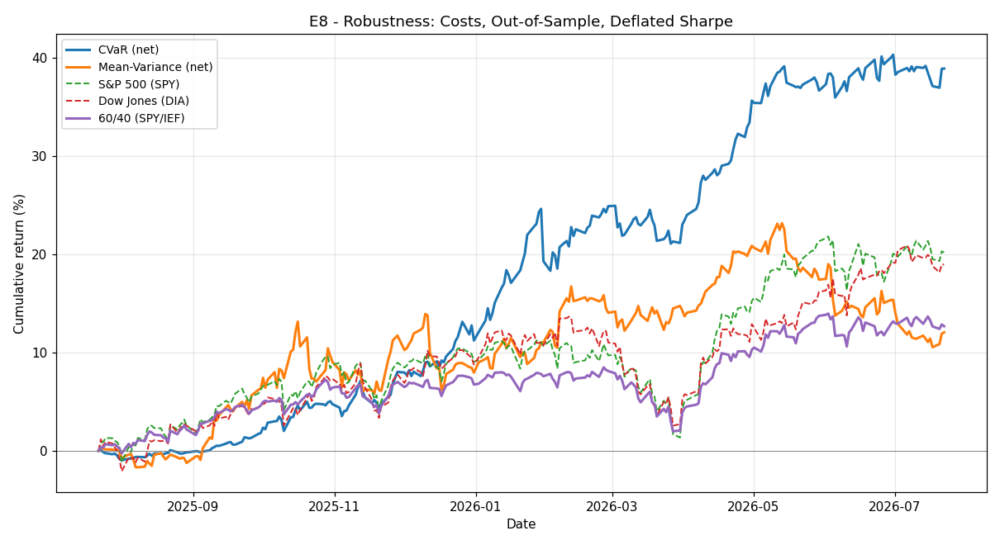

# E8 - Robustness: Costs, Out-of-Sample, Deflated Sharpe

**Window:** 2025-07-22 → 2026-07-22 (252 trading days)  
**Universe selected as of:** 2022-06-14 (no lookahead)

Directly addresses the four reasons a high backtested return draws skepticism: overfitting, transaction costs, data leakage, and benchmark selection.

### 1. Transaction costs (gross vs net, last 252d)
Net charges 10 bps per unit of L1 turnover on every rebalance; gross charges nothing. The gap is the honest cost drag:

| Strategy | Ann. Return | Ann. Vol | Sharpe (excess) | Max Drawdown |
|---|---|---|---|---|
| CVaR gross (0 bps) | 42.30% | 10.89% | 3.52 | -5.05% |
| CVaR net (10 bps) | 38.90% | 10.81% | 3.23 | -5.06% |
| Mean-Variance gross (0 bps) | 15.16% | 13.85% | 0.81 | -9.40% |
| Mean-Variance net (10 bps) | 12.06% | 13.84% | 0.58 | -10.24% |

### 2. Overfitting - out-of-sample consistency
The same frozen strategy scored on consecutive, non-overlapping ~1y sub-windows (net of costs). A single lucky year is easy; consistency across windows is not:

| Window | Ann. Return | Sharpe (excess) | Max Drawdown |
|---|---|---|---|
| CVaR W1 (2023-06-16->2024-06-17) | 9.15% | 0.67 | -7.14% |
| CVaR W2 (2024-06-18->2025-06-20) | 0.33% | -0.41 | -9.33% |
| CVaR W3 (2025-06-23->2026-06-23) | 38.51% | 3.32 | -5.06% |
| **CVaR mean** | **16.00%** | **1.19** | - |
| **CVaR worst** | **0.33%** | **-0.41** | - |
| Mean-Variance W1 (2023-03-13->2024-03-12) | 11.13% | 0.68 | -6.23% |
| Mean-Variance W2 (2024-03-13->2025-03-14) | 4.44% | 0.03 | -10.78% |
| Mean-Variance W3 (2025-03-17->2026-03-17) | 6.45% | 0.17 | -9.72% |
| **Mean-Variance mean** | **7.34%** | **0.29** | - |
| **Mean-Variance worst** | **4.44%** | **0.03** | - |

### 2b. Overfitting - deflated Sharpe (multiple testing)
Probability the excess Sharpe is real after ~8 configurations were tried on this data: **CVaR 0.87**, **Mean-Variance 0.20** (near 1.0 survives skepticism; near 0.5 is plausibly a fluke of selection).

### 3. Data leakage
Universe selection is point-in-time (`end_date=SELECT_END`); each trade uses only returns strictly before the trade day (now asserted in both backtests). Prices are split+dividend adjusted. Remaining bias: `CANDIDATE_POOL` is a survivors list (documented in `market_analyzer.py`), so absolute returns are optimistic.

### 4. Benchmark selection
Benchmarks use dividend-adjusted total-return prices, a 4% risk-free rate for excess Sharpe, and add a 60/40 (SPY/IEF) comparator since these strategies often hold cash and run below-market volatility.

**CVaR universe:** `['KO', 'TSLA', 'CAT', 'EEM', 'LQD', 'SLV', 'PDBC', 'UNH']`

**Mean-Variance universe:** `['CAT', 'HYG', 'UNH', 'SLV', 'AVGO', 'KO', 'PDBC', 'EEM', 'TSLA']`

## Results

| Strategy | Ann. Return | Ann. Vol | Sharpe (excess) | Max Drawdown |
|---|---|---|---|---|
| CVaR (net) | 38.90% | 10.81% | 3.23 | -5.06% |
| Mean-Variance (net) | 12.06% | 13.84% | 0.58 | -10.24% |
| S&P 500 (SPY) | 20.17% | 12.66% | 1.28 | -8.88% |
| Dow Jones (DIA) | 18.96% | 12.28% | 1.22 | -9.76% |
| 60/40 (SPY/IEF) | 12.68% | 8.20% | 1.06 | -6.00% |

