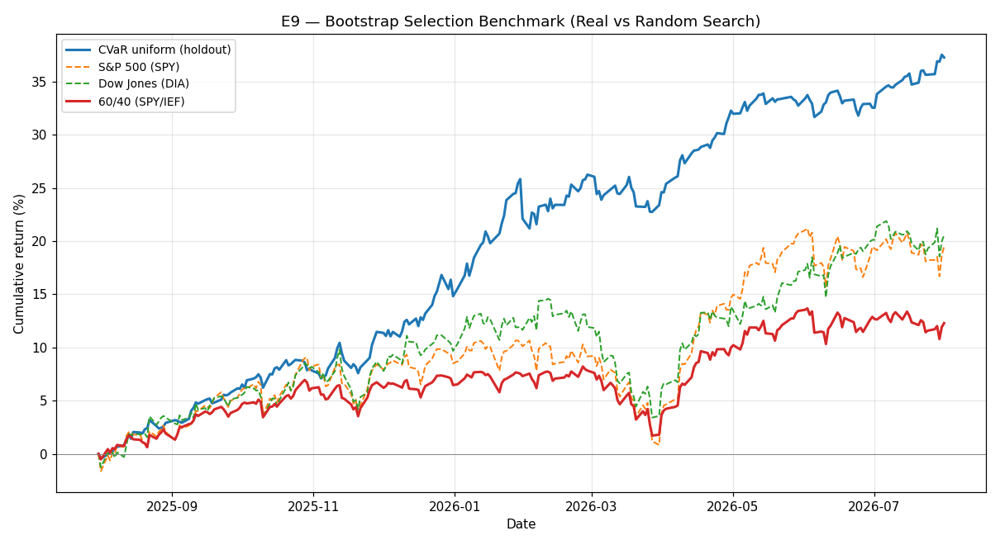

# E9 — Bootstrap Selection Benchmark (Real vs Random Search)

**Window:** 2025-07-31 → 2026-07-31 (252 trading days)  
**Universe selected as of:** 2022-06-24 (no lookahead)

Randomized-data benchmark of the *selection process* (inspired by the 2016 report's real-vs-random strategy search). Unlike E8's analytic Deflated Sharpe (which assumes a fixed N_TRIALS), E9 re-runs universe + config selection on 5 stationary block-bootstrap return panels (block=10 days), preserving cross-asset dependence and local vol clustering while destroying long-horizon spurious alpha.

### Real-data selection Sharpes (pre-holdout)

| Config | Selection Sharpe |
|---|---|
| CVaR uniform | 0.10 |
| CVaR adaptive | -1.07 |
| MV relative-BL | -0.73 |
| MV absolute-BL | -0.54 |

**Selected:** `CVaR uniform` with selection Sharpe **0.10**

### Bootstrap null (best Sharpe under no-alpha)

- Bootstrap samples with a finite best Sharpe: **5/5**
- Mean / 95th pct of best bootstrap Sharpe: **2.87** / **4.71**
- Empirical p-value P(boot best ≥ real best): **0.800**

A small p-value means the real selection result is extreme vs chance searching; a large p-value means the reported edge is consistent with overfitting from trying many rules.

### Untouched holdout (last ~1y, frozen after selection)

| Strategy | Ann. Return | Ann. Vol | Sharpe (excess) | Max Drawdown |
|---|---|---|---|---|
| CVaR uniform (holdout) | 37.27% | 8.60% | 3.87 | -3.69% |

## Results

| Strategy | Ann. Return | Ann. Vol | Sharpe (excess) | Max Drawdown |
|---|---|---|---|---|
| CVaR uniform (holdout) | 37.27% | 8.60% | 3.87 | -3.69% |
| S&P 500 (SPY) | 19.50% | 12.91% | 1.20 | -8.88% |
| Dow Jones (DIA) | 20.59% | 12.52% | 1.33 | -9.76% |
| 60/40 (SPY/IEF) | 12.28% | 8.38% | 0.99 | -6.00% |

